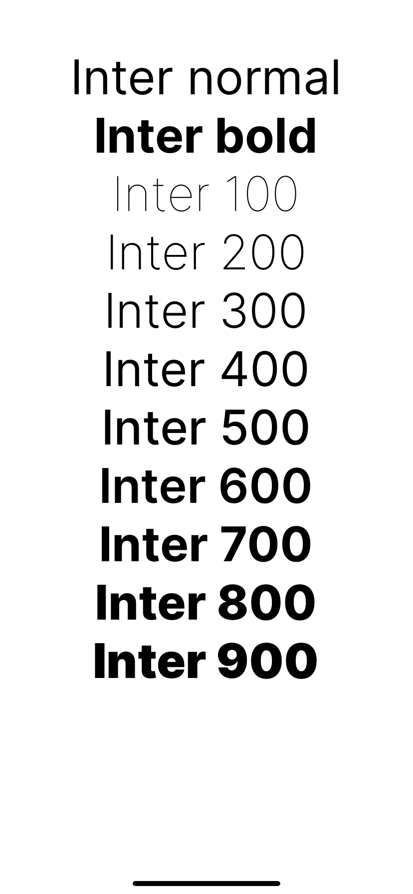

<p align="center">
  
</p>

<h3 align="center" style="font-weight:600">

`umiko`

</h3>

<p align="center">
  Font weights in React Native, but if they actually worked correctly.
</p>

---

<div align="center">

[](https://github.com/expo/expo)
[](https://github.com/expo/expo)
[](https://github.com/expo/expo)

</div>

## NANI??

This library was inspired by the realization that `expo-fonts` can load fonts from remote URLs and that when you set up fonts in your Expo/RN app, you have to do more ceremony than you have to do on the web.

In RN, you have to specify a different `fontFamily` for different weights of the same typeface rather than just being able to specify a `fontWeight` and resolve to the right file as you are able to do on the web with `@font-face` in CSS.

The initial version of the library will support `Inter`, but hopefully it's simple enough for you to be able to PR in other typefaces that you want to use this way easily.

## Example

```tsx
import React from "react";
import { ScrollView, StyleSheet } from "react-native";

import { useTypefaces, Text } from "umiko";

export default function App() {
  const fontsLoaded = useTypefaces({ Inter: true });

  return fontsLoaded ? (
    <ScrollView
      style={{ flex: 1, marginVertical: 48 }}
      contentContainerStyle={{ justifyContent: "center", alignItems: "center" }}
    >
      {[
        "normal",
        "bold",
        "100",
        "200",
        "300",
        "400",
        "500",
        "600",
        "700",
        "800",
        "900",
      ].map((weight) => (
        <Text
          key={weight}
          style={{
            fontFamily: "Inter",
            fontWeight: weight,
            fontSize: 48,
          }}
        >
          Inter {weight}
        </Text>
      ))}
    </ScrollView>
  ) : null;
}
```

<p align="center">
  
</p>

Check out the [demo](./packages/demo/App.tsx) to learn more about how to use it.

## Caveats

- You must `import { Text } from 'umiko';` to get proper font usage.
- Nesting `<Text>` components doesn't inherit styles from its parent, so you must specify styles for each `Text`.
- This only supports inline styles. Registering styles from `StyleSheet.create` will result in an error.
